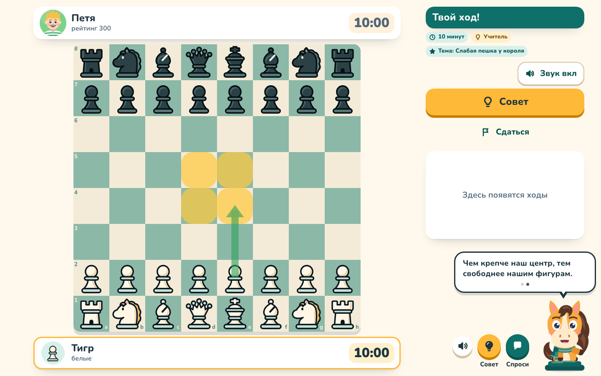
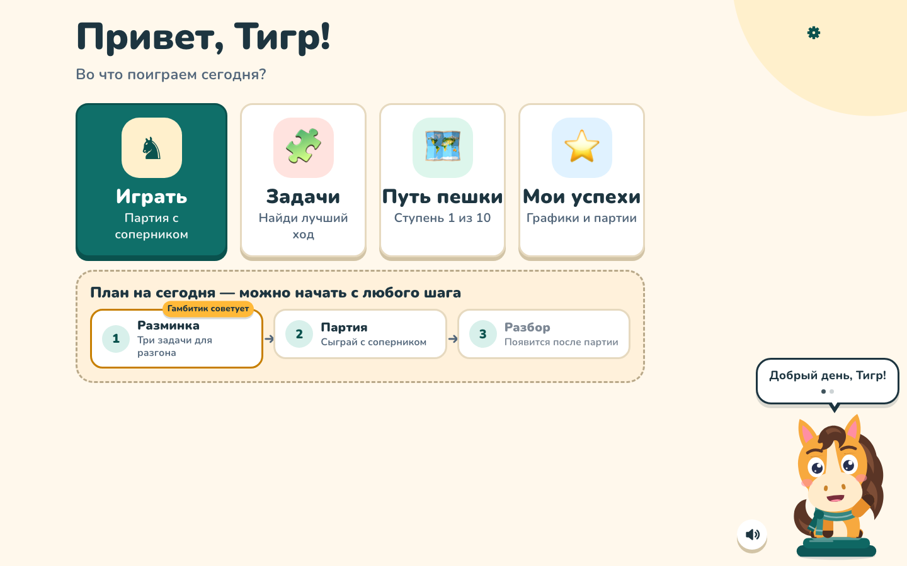

# Гамбитик — шахматный тренер для детей

[](https://github.com/artemiimillier/gambitik/actions/workflows/ci.yml)
[](LICENSE)

**Гамбитик** — бесплатное приложение, в котором дети 7–10 лет учатся играть в шахматы. Ребёнок играет с
ботами-персонажами, а маскот-тренер Гамбитик (весёлый конь) объясняет ходы простыми словами, задаёт вопросы с
кнопками, хвалит за дело и предлагает вернуть ход, если ребёнок ошибся. Есть задачи, учебная программа из
ступеней и разбор каждой партии.

Без рекламы, без слежки, без платных API. Ходы считает шахматный движок Stockfish прямо в браузере, а все слова
тренера написаны заранее и проверены тестами — **в партии ребёнка нет генеративного ИИ**.

<!-- TODO: ссылка на публичный экземпляр, когда будет куплен домен -->



<details>
<summary>Ещё скриншот: главный экран</summary>



</details>

[English below ↓](#english)

## Что умеет

- **Партии с ботами-персонажами** разной силы: без часов, 10, 5 или 1 минута.
- **Три режима тренера:** 🎓 «Учитель» — объясняет каждый ход и показывает хорошие ходы (одна тема на партию);
  💡 «Подсказчик» — помогает, когда попросишь; 🏆 «Экзамен» — без подсказок.
- **«Верни ход и подумай»** — после ошибки Гамбитик предлагает переходить и объясняет правило, а не просто
  «так нельзя».
- **Вопросы с кнопками** («Что задумал соперник?»), похвала только за дело — без пустого «молодец».
- **Гамбитик не называет клетки** — он говорит, зачем ход; куда ходить, показывают стрелка и подсветка.
- **Задачи** из базы Lichess, подобранные по возрасту, и повторение трудных тем.
- **«Путь пешки»** — программа из 10 ступеней; словарь тренера растёт вместе с ребёнком.
- **Разбор партии** и «Мои успехи»: графики, все партии, сильные и слабые стороны.
- **Записанный голос** — Гамбитик говорит готовыми фразами (в репозитории — небольшой набор записей); или голос
  компьютера, или без звука.
- **Работает на своём компьютере**: все данные ребёнка хранятся локально. Для публичного сайта есть
  необязательные аккаунты — ник и пароль, без почты и настоящих имён.

## Быстрый старт

Нужны **Node.js 26+** и **pnpm 11** (точная версия — поле `packageManager` в `package.json`).

```bash
git clone https://github.com/artemiimillier/gambitik.git
cd gambitik

# pnpm: через corepack, если он есть в вашей сборке Node…
corepack enable
# …или напрямую (в Node 25+ corepack не входит):
npm install --global pnpm@11.5.2

pnpm install
pnpm dev
```

Откройте **<http://localhost:5173>**. `pnpm dev` запускает сервер API на `127.0.0.1:8787` и Vite на `:5173`;
перед запуском движок Stockfish сам копируется в `apps/web/public/engine/`. Данные ребёнка появятся в папке
`data/` (она не попадает в git).

Прод-режим одним процессом: `pnpm build && pnpm start` → <http://127.0.0.1:8787>.

### Ключи API не нужны

Всё работает «из коробки»: создавать `.env` не обязательно. По умолчанию:

| Переменная | Значение | Что значит |
|---|---|---|
| `GAMBIT_RUNTIME_AI` | `0` | в партии нет генеративного ИИ: только Stockfish, наш код и готовые фразы |
| `LLM_PROVIDER` | `template` | разборы партий — по встроенным шаблонам |
| `GAMBIT_CLIP_GEN` | `0` | новые фразы голосом не записываются (платный генератор не вызывается) |

Необязательные экспериментальные функции (живой голос OpenAI, ИИ-разборы) описаны в
[`.env.example`](.env.example) и [docs/DEVELOPMENT.md](docs/DEVELOPMENT.md); для детей они выключены.

## Тесты

```bash
pnpm typecheck                        # TypeScript во всех пакетах и в e2e
pnpm test                             # модульные тесты (Vitest)
pnpm build                            # сборка сайта

pnpm exec playwright install chromium # один раз: браузер для e2e
pnpm e2e                              # сквозные тесты: настоящий `pnpm dev` + Chromium
```

E2E-тесты поднимают свой сервер с временной папкой данных, без ключей и без звука. Порты 5173 и 8787 должны быть
свободны (другие порты: `GAMBIT_WEB_PORT=5174 GAMBIT_API_PORT=8788 pnpm e2e`). То же самое проверяет CI на
каждый pull request (`.github/workflows/ci.yml`).

## Свой сервер

`Dockerfile` в корне собирает один контейнер: сервер раздаёт API и сайт на порту 8787, без ключей и платных
функций. Пример выкладки по SSH на сервер с Docker и HTTPS-прокси — [deploy/docker-ssh/](deploy/docker-ssh/)
(настройки цели — в `deploy/docker-ssh/deploy.env`, он не попадает в git). Аккаунты публичного сайта
(`GAMBIT_ACCOUNTS=1`) — [docs/ACCOUNTS.md](docs/ACCOUNTS.md).

## Голос

В репозитории лежит только **небольшой набор записанных фраз** (`apps/web/public/voice/`, набор `pilot`: он покрывает демо-партию). Фразы, которых нет в
записи, Гамбитик пишет в облачке (или произносит голосом компьютера, если так выбрано в Настройках). Инструменты
записи новых фраз (`tools/voice-clips/`, `pnpm voice:*`) — необязательные авторские инструменты: им нужен платный
аккаунт Higgsfield, для запуска и разработки приложения они не нужны. Подробно — [docs/voice-clips/](docs/voice-clips/).

## Как устроен проект

```
apps/web          @gambit/web       — React + Vite: доска, экраны, маскот, Stockfish в Web Worker
apps/server       @gambit/server    — Node 26 + Hono + SQLite: хранилище, задачи, разборы, аккаунты
packages/shared   @gambit/shared    — общие типы и контракты API
packages/core     @gambit/core      — анализ ходов и «язык» тренера (без DOM и node:)
packages/content  @gambit/content   — персонажи, программа, стратегии, тексты уроков
packages/openings @gambit/openings  — названия дебютов
tools             @gambit/tools     — импорт задач, сборка дебютов, отчёт по урокам, запись голоса
e2e/              Playwright-тесты всего приложения
kb/               стартовый набор задач
```

Пакеты подключаются как исходники TypeScript, без шага сборки: Node 26 сам убирает типы. Поэтому в коде только
«стираемый» синтаксис (без `enum`, `namespace`), а относительные импорты — с расширением `.ts`/`.tsx`.

Подробнее:
- [docs/ARCHITECTURE.md](docs/ARCHITECTURE.md) — архитектура и путь одного хода;
- [docs/TEACHING.md](docs/TEACHING.md) — как Гамбитик учит: модель урока и правила текстов;
- [docs/DEVELOPMENT.md](docs/DEVELOPMENT.md) — все команды, данные, приватность, API сервера, запуск на Mac;
- [docs/research/](docs/research/) — исследования, на которых основаны решения.

## Как помочь проекту

Мы рады исправлениям, тестам, задачам и поправкам к текстам тренера. Прочитайте
[CONTRIBUTING.md](CONTRIBUTING.md) — там по шагам, как сделать fork и pull request, и главные правила: тексты для
детей 7–10 лет, никакого генеративного ИИ в партии, никакой слежки и сбора личных данных.
Правила общения — [CODE_OF_CONDUCT.md](CODE_OF_CONDUCT.md). Об уязвимостях — только приватно, см.
[SECURITY.md](SECURITY.md).

## Лицензия / License

- **Код** — [GNU AGPL-3.0-or-later](LICENSE). Если вы запускаете изменённую версию как сайт, её исходный код
  должен быть доступен пользователям этого сайта.
- **Чужие компоненты** (Stockfish — GPL-3.0, шрифт Nunito — OFL-1.1, задачи и дебюты Lichess — CC0, библиотеки
  npm) — со своими лицензиями, см. [THIRD_PARTY_NOTICES.md](THIRD_PARTY_NOTICES.md).
- **Записанный голос** (аудиофайлы в `apps/web/public/voice/**`, сгенерированы в Higgsfield голосом MiniMax
  «Giselle») **не** под AGPL: © автор проекта, все права защищены; их можно использовать только в составе этого
  проекта. Подробно — [THIRD_PARTY_NOTICES.md](THIRD_PARTY_NOTICES.md).

---

## English

**Gambitik** («Гамбитик») is a free, open-source chess trainer for Russian-speaking kids aged 7–10. The child plays
against bot characters while an animated mascot coach explains moves in simple words, asks multiple-choice
questions, praises real achievements and offers a take-back after a mistake. It also has puzzles (from the Lichess
database), a 10-stage curriculum and a review of every game. The UI and all coaching texts are in Russian.

- **No generative AI in the child's game** (by design): Stockfish 19 (WebAssembly, in a Web Worker) computes the
  moves, and every coach phrase is pre-written and checked by tests. No ads, no tracking, no API keys required.
- **Stack:** pnpm monorepo, TypeScript, React + Vite (`apps/web`), Node 26 + Hono + SQLite (`apps/server`),
  Vitest and Playwright.

**Quick start** (Node 26+, pnpm 11):

```bash
git clone https://github.com/artemiimillier/gambitik.git && cd gambitik
npm install --global pnpm@11.5.2   # or: corepack enable (if your Node still ships corepack)
pnpm install
pnpm dev                           # open http://localhost:5173
```

**Checks:** `pnpm typecheck`, `pnpm test`, `pnpm build`; end-to-end: `pnpm exec playwright install chromium`, then
`pnpm e2e`. **Self-hosting:** the `Dockerfile` and [deploy/docker-ssh/](deploy/docker-ssh/). **Details:**
[docs/ARCHITECTURE.md](docs/ARCHITECTURE.md), [docs/DEVELOPMENT.md](docs/DEVELOPMENT.md) (Russian).
**Contributing:** [CONTRIBUTING.md](CONTRIBUTING.md). **Security:** [SECURITY.md](SECURITY.md).

**License:** code under [AGPL-3.0-or-later](LICENSE); third-party parts under their own licences
([THIRD_PARTY_NOTICES.md](THIRD_PARTY_NOTICES.md)). The recorded voice audio in `apps/web/public/voice/**`
(generated with Higgsfield, MiniMax «Giselle» voice) is **not** covered by the AGPL: © the project author, all rights
reserved, usable only as part of running this project.
